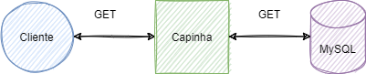

## Crud capinhas de celular

Aplicação para cadastrar produto utilizando o protocolo de comunição REST.

Tendo como tecnologias e padrões utilizados para o desenvolvimento dessa API:

- Spring boot/ Java 11
- JUnit
- REST
- MVC
- SOLID
- LOGGER  
- MySQL



## Pre-requisites

- Java 11
- Maven


## Dependencies


**Health Check**

Dependência para verificar a saúde da aplicação
```gradle
		<dependency>
			<groupId>io.springfox</groupId>
			<artifactId>springfox-swagger-ui</artifactId>
			<version>2.9.2</version>
		</dependency>
```
**Swagger**

Dependência para documentar a API

```gradle
        <dependency>
			<groupId>io.springfox</groupId>
			<artifactId>springfox-swagger2</artifactId>
			<version>3.0.0</version>
		</dependency>
		<dependency>
			<groupId>io.springfox</groupId>
			<artifactId>springfox-swagger-ui</artifactId>
			<version>2.9.2</version>
		</dependency>
```

## Running application

Para rodar a aplicação localmente, o seguinte comando maven pode ser utilizado:

```gradle
./mvn clean install run
```

## Endpoints

**/v1/endereco**

```gradle
curl 'http://localhost:8080/v1/capinhas'
```

**Health Check**


````gradle
 curl 'http://localhost:8080/actuator/health'  
 
````

